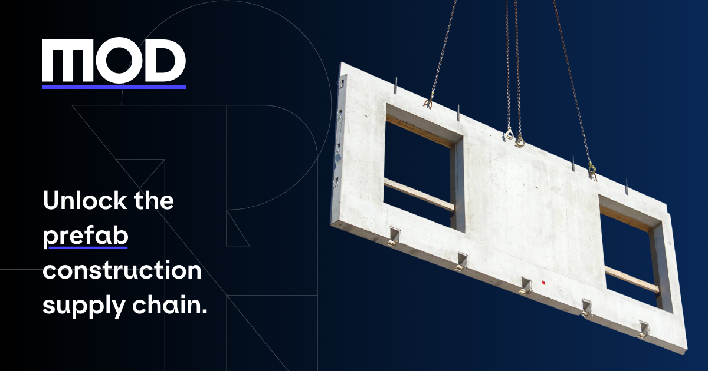

# Welcome to MOD

<!-- markdownlint-disable MD033 -->

  

At MOD, we've learned that real progress is driven by individuals who **dare to go further. But only when they're supported by a team of like-minded people** pushing in the same direction. That's how we believe the world (and construction) can be changed.

So, as a team, we want you to **chase the edge**, even when it feels too far.

---

## 🚀 Our Mission

MOD is an **AI-native open source software platform** to make industrialized construction **100x more intelligent, scalable, and efficient**.

Prefabrication is 50% faster, 20% cheaper and 30% more sustainable than on-site construction, but the supply chain for prefabrication is not working yet and the integration of prefab elements in traditional construction projects is challenging.

Our **award-winning platform** checks the prefab potential of any architectural design and orchestrates the supply chain to significantly increase the prefab share. It is **100% model-based and deeply integrated** into the current design and procurement processes.

---

## 🏗️ Why MOD Matters

We **started in 2024** and the reception has been enthusiastic from the get-go. Leading real estate developers work with MOD to check their projects’ industrialization potential, integrate prefabricated elements in their designs and gain access to the **largest prefab supplier library on the globe** with currently 4,500 pre-qualified manufacturers.

Started by **two veteran entrepreneurs** — with both great successes and humbling failures under their belts — we're now expanding the team to take MOD to the next level.

---

## 🌍 Join Us

Are you someone who chases the edge like we do? Then this could be your opportunity to join our co-founders on a mission to **unlock industrialized construction for the 95% of construction projects still built the traditional way**.

[Visit our website](https://mod.construction) · [Explore our GitHub](https://github.com/mod-construction)